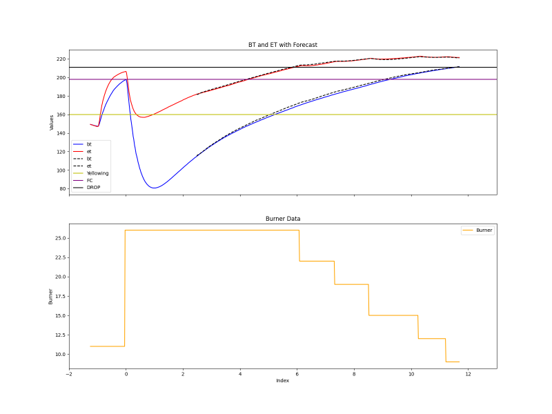

# Coffee Roasting Curve Prediction Model

This project aims to develop a neural network model for inline time-series prediction of the coffee roasting curve, laying the foundation for an automated coffee roasting tool. The goal is to move beyond the conventional PID control, which only minimizes the difference from a set value, toward a system that simulates the decision-making process of a skilled human operator.

### Project Overview
By predicting the coffee roasting curve the model enables more precise control of burner output, targeting an optimal roast profile. Traditional methods for coffee roasting system modelling[[1]](https://doi.org/10.1016/j.rineng.2024.102575) fail to provide satisfactory results due to non-stationarity, non-linearity, and partial observability of the system dynamics (different coffees respond differently to the burner output, also temperature readings are only an approximation of the real state of the system). By utilizing data-driven approach, where we use historical data of coffee roasting to train the RNN model we can achieve higher accuracy in predicting the systems behaviour, thus allowing us to produce higher quality roast.

*In black dashed lines we can observe the model's output given as an input only first 3 minutes of the temperature curves along the burner changes.
We can see an almost perfect fit to the real roast curve's ET and BT. Thanks to the added Attention Mechanisms model focuses strongly on the changes made in the burner value, which is especially visible in the ET curve*

### Model Description
Current version of model utilizes LSTM [[2]](https://doi.org/10.1162/neco.1997.9.8.1735) network with Masked Attention Mechanism[[3]](https://doi.org/10.48550/arXiv.1706.03762) running in the autoregressive mode. As an input model takes timeseries data consisting of two temperature curves (Bean Temperature - BT, and Environment Temperature - ET) along with timeseries of burner value accross the roasting process. During Inference Time, burner value is used as exogenous input which we can modulate in order to simulate system dynamics (response of temperature curves on the burner settings)

### Objectives
Accurate Prediction of Roasting Curve

Generate a reliable prediction of the coffee roasting curve to anticipate the roast progression.

### Future Steps
Burner Control Model: Implement a model that utilizes the curve prediction to adjust burner output and achieve specified roast goals.

Refinement of Prediction Model: Fine-tune the model's predictive capabilities with additional roasting data for improved accuracy and adaptability to different machines.

---
### References

[[1]H.G. Schwartzberg, Modeling bean heating during batch roasting of coffee beans, J. Welti-Chanes, G. V Barbosa-Canovas, J.M. Aguilera (Eds.), Engineering and Food for the 21st Century (first ed.), CRC Press, Boca Raton (2002), p. 1104](https://doi.org/10.1016/j.rineng.2024.102575)

[[2] Hochreiter, S., & Schmidhuber, J. (1997). Long Short-Term Memory. Neural Computation, 9(8), 1735–1780.](https://doi.org/10.1162/neco.1997.9.8.1735)

[[3] Vaswani, A., Shazeer, N., Parmar, N., Uszkoreit, J., Jones, L., Gomez, A. N., Kaiser, L., et al. (2017). Attention is all you need. Advances in Neural Information Processing Systems, 5998-6008.](https://doi.org/10.48550/arXiv.1706.03762)
